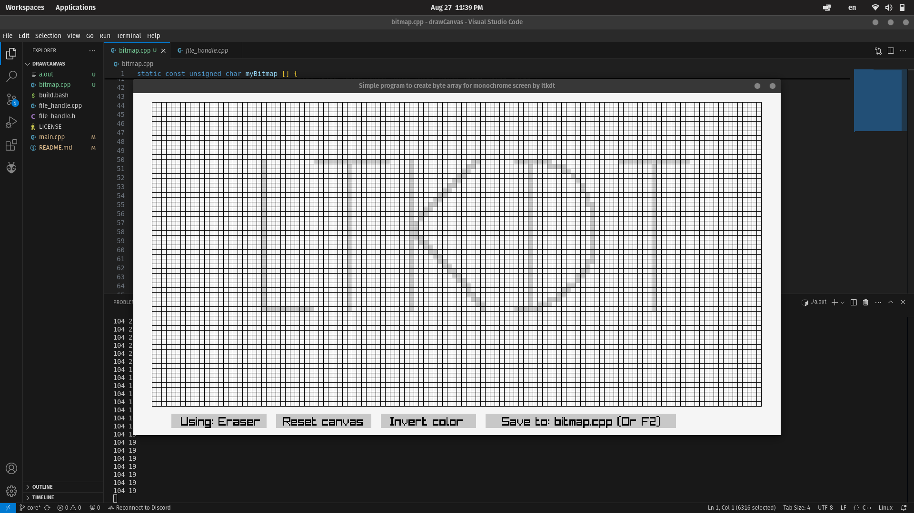

# Simple Program to draw image as byte array for OLED Arduino

This is my raylib project to draw bitmap that is meant to be displayed on an OLED screen with the resolution of 128x64 pixels. 

My basic implementation for this project is complete. I will keep updating it in the main branch but the core branch remains the same.

For now you can:
 - Draw on the canvas
 - Erase pixels
 - Invert color
 - Save cpp code of your bitmap in bitmap.cpp. Copy it to your personal project and use it to display on your OLED screen
 
 Run `bash build.bash` to run the project.

 Below is a demo screenshot:

