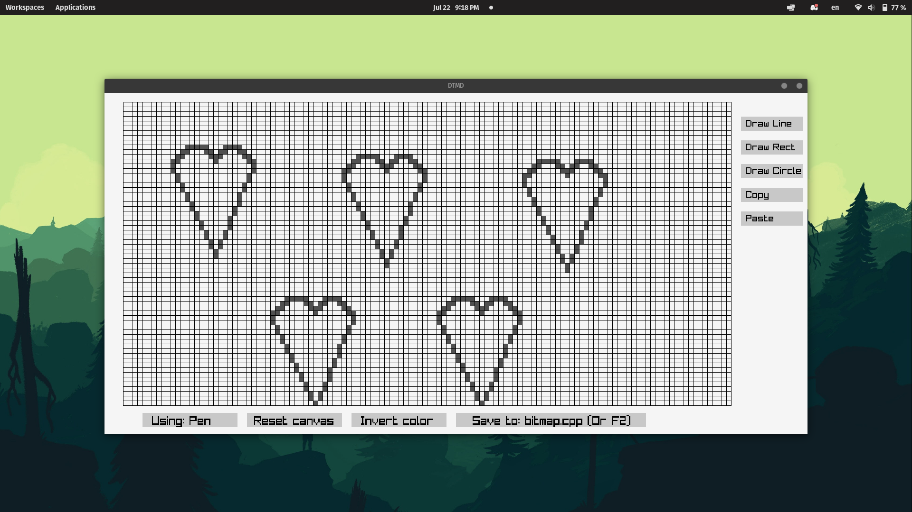
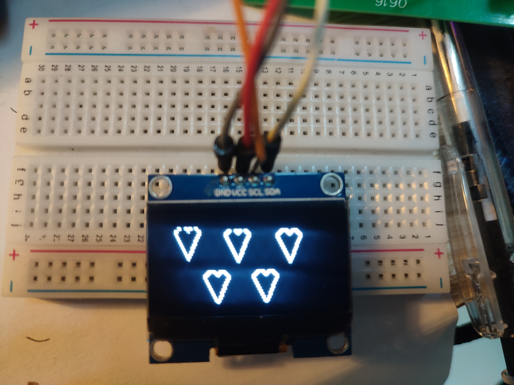

# DTMD - Drawing Tool for Monochrome Display 

This is my Raylib project to draw bitmap as byte array that is meant to be displayed on monochrome display using a library such as
U8G2 or Adafruit SSD1306 / SH110X to read the bitmap as byte array then display it to the screen

This project is still in progress, but for now it has just enough features for my use. 

For now you can:

 - Draw on the canvas
 - Erase pixels
 - Invert color
 - Save cpp code of your bitmap in a custom file given the path. Copy it to your personal project and use it to display on your OLED screen
 - Draw basic shape: line, rect, circle
 - Read image from another cpp bitmap file

Assume that you have set up raylib already, build the program by go to src, then run `make`.
An executable called program is now available in build folder.

Demo:

Progam UI:

Output on OLED screen:
